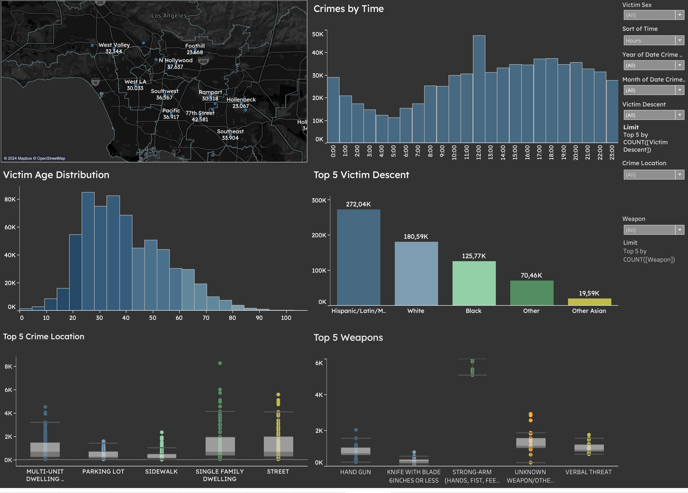

# LA Crime



In this project, I aim to analyze and visualize crime data in Los Angeles from the year 2020 onwards, leveraging the power of **Tableau** for insightful and interactive data visualizations. By utilizing public data, I seek to uncover trends, patterns, and insights into the nature of crime in the city. My goal is to contribute to informed community and policy responses by providing a comprehensive and accessible view of crime dynamics through Tableau dashboards. This allows stakeholders to explore the data in a user-friendly format, facilitating a deeper understanding and fostering a proactive approach to crime prevention and policymaking.

## Data Source

The analysis is based on the "Crime Data from 2020 to Present" dataset available from the [Los Angeles Open Data Portal](https://data.lacity.org/). This dataset encompasses detailed records of reported crimes in Los Angeles, including attributes like the type of crime, location, date, and time.

Below is an overview of the dataset attributes:

| Column Name   | Description | Type |
|---------------|-------------|------|
| DR_NO         | Division of Records Number: Official file number made up of a 2 digit year, area ID, and 5 digits | Plain Text |
| Date Rptd     | Date reported as MM/DD/YYYY | Date & Time |
| DATE OCC      | Date of occurrence as MM/DD/YYYY | Date & Time |
| TIME OCC      | Time of occurrence in 24-hour military time | Plain Text |
| AREA          | The LAPD's 21 Community Police Stations numbered from 1-21 | Plain Text |
| AREA NAME     | Name designation of Geographic Areas or Patrol Divisions | Plain Text |
| Rpt Dist No   | A code representing a sub-area within a Geographic Area | Plain Text |
| Part 1-2      | Indicates whether the crime is considered Part 1 (more serious) or Part 2 | Number |
| Crm Cd        | Indicates the crime committed | Plain Text |
| Crm Cd Desc   | Description of the Crime Code provided | Plain Text |
| Mocodes       | Modus Operandi: Activities associated with the suspect | Plain Text |
| Vict Age      | Age of the victim | Number |
| Vict Sex      | Sex of the victim: F - Female, M - Male, X - Unknown | Plain Text |
| Vict Descent  | Descent of the victim | Plain Text |
| Premis Cd     | Code for the type of structure, vehicle, or location of the crime | Number |
| Premis Desc   | Description of the Premise Code | Plain Text |
| Weapon Used Cd| Code for the type of weapon used | Plain Text |
| Weapon Desc   | Description of the Weapon Used Code | Plain Text |
| Status        | Status of the case | Plain Text |
| Status Desc   | Description of the Status provided | Plain Text |
| Crm Cd 1      | Primary and most serious crime committed | Plain Text |
| Crm Cd 2      | Code for an additional crime, less serious than Crime Code 1 | Plain Text |
| Crm Cd 3      | Code for an additional crime, less serious than Crime Code 1 | Plain Text |
| Crm Cd 4      | Code for an additional crime, less serious than Crime Code 1 | Plain Text |
| LOCATION      | Street address of crime incident (rounded to the nearest hundred block) | Plain Text |
| Cross Street  | Cross street of the rounded address | Plain Text |
| LAT           | Latitude coordinate of the crime incident | Number |
| LON           | Longitude coordinate of the crime incident | Number |

For more details and to download the dataset, visit the [Los Angeles Open Data Portal](https://data.lacity.org/A-Safe-City/Crime-Data-from-2020-to-Present/kpu4-3xbg).

## Methodology

The project's analytical framework is designed to unveil crime trends and spatial patterns in Los Angeles from 2020 to the present, utilizing a dataset curated from the Los Angeles Open Data Portal. The analysis will be conducted through the following refined steps:

1. **Data Cleaning and Preprocessing**:
   - Eliminate columns that do not contribute to the analysis, including 'DR_NO', 'Date Rptd', 'AREA', 'Rpt Dist No', 'Crm Cd', 'Mocodes', 'Premis Cd', 'Weapon Used Cd', 'Status', 'Crm Cd 1', 'Crm Cd 2', 'Crm Cd 3', 'Crm Cd 4', 'Cross Street', and 'Part 1-2'.
   - Convert 'DATE OCC' to date format and 'TIME OCC' to a datetime format to streamline the temporal analysis.
   - Replace code identifiers with descriptive names in fields such as 'Crm Cd Desc', 'Premis Desc', and 'Weapon Desc' to enhance interpretability.
   - Cleanse the dataset of outliers and anomalous values that could skew the analysis, particularly zero values in 'Vict Age' which may lead to deviations in trend analysis.

2. **Temporal Analysis**:
   - Aggregate cleaned crime data by date to examine trends and identify potential cyclical behavior or seasonality in crime rates.

3. **Descriptive Analysis**:
   - Perform a detailed examination of the types of crimes, victim demographics, and the circumstances under which crimes occur.
   - Identify and interpret patterns related to crime types, victim age, sex, and descent.
   - Implement dynamic time-filtering in the Tableau dashboard using calculated fields to allow stakeholders to explore crime trends by hours, months, and years. The time-filtering functionality will be established using the following calculated fields:
     ```tableau
     CASE [Time Filter]
       WHEN 'Hours' THEN DATEPART('hour', [Time Crime Occurrence])
       WHEN 'Months' THEN DATEPART('month', [Date Crime Occurrence])
       WHEN 'Years' THEN DATEPART('year', [Date Crime Occurrence])
     END
     ```
     And for axis labeling to reflect the selected time frame appropriately:
     ```tableau
     CASE [Time Filter]
       WHEN 'Hours' THEN STR(DATEPART('hour', [Time Crime Occurrence])) + ':00'
       WHEN 'Months' THEN DATENAME('month', [Date Crime Occurrence])
       WHEN 'Years' THEN STR(DATEPART('year', [Date Crime Occurrence]))
     END
     ```

4. **Data Visualization and Dashboard Development**:
   - Design a Tableau dashboard to dynamically represent the analytical findings, allowing stakeholders to interact with the data through various lenses.
   - Incorporate a range of visual tools within the dashboard, including time-based line charts.
   - Include interactive elements such as neighborhood selectors, and sex victims.

The Tableau dashboard created as a result of this methodology will serve as an intuitive platform for exploring crime trends, revealing the multi-dimensional nature of crime in Los Angeles, and informing data-driven decision-making.

This project aims to provide a comprehensive tool for understanding crime dynamics, with the potential to support policy formulation, resource allocation, and community awareness.

## Tools and Technologies

The project utilized a streamlined and powerful set of tools and technologies to process, analyze, and visualize the crime data effectively:

- **Python**: Served as the backbone for data processing and cleaning. Its robust programming capabilities were crucial for preparing the dataset for analysis.
- **Pandas**: This Python library was instrumental in data manipulation, enabling the transformation, cleansing, and preparation of the dataset with its DataFrame structure.
- **Jupyter Notebook**: All data processing steps were meticulously documented and executed in a Jupyter Notebook, providing a transparent and reproducible environment for the analysis.
- **Tableau**: As the primary tool for visualization, Tableau offered the flexibility and power to create an interactive and insightful dashboard. It allowed us to transform the cleaned data into a series of compelling visual stories, making the findings accessible to all stakeholders.

## Contribution Guidelines
To contribute, please fork the repository and submit a pull request with your suggested changes. For major changes, please open an issue first to discuss what you would like to change.

## Contact Information
For support or queries, reach out to me at [my email address](mailto:albertevieites@gmail.com).

## Acknowledgements
Special thanks to [Yusuf Satilmis](https://github.com/yusufsjustit) for his invaluable assistance in this project.